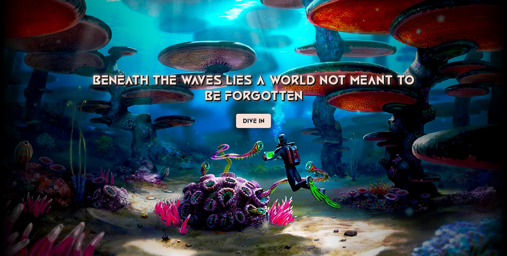

# 🌊 Splash Page – Beneath The Waves

A visually striking **splash landing page** with a dark ocean theme, minimal typography, and a captivating “Dive In” call-to-action.  
Built with **HTML** and **CSS**, this project demonstrates overlay effects, gradient blending, and text styling with custom fonts.

---

## ✨ Features

- 🌅 Fullscreen **splash layout** with background imagery
- 🌊 **Gradient overlay** for cinematic lighting effect
- ✍️ **Custom display font** “Black Future” for headline
- 🪄 **Text shadow & stroke** for depth and contrast
- 🖱️ Interactive **hover animation** on button
- 🖼️ Clean and minimal aesthetic for impactful storytelling

---

## 🌐 Live Demo / Review

You can view the live splash page here:  
👉 [Live Demo](https://harsh-codes-hub.github.io/splash-page-TASK2/)

Experience the **Beneath The Waves** entry screen directly in your browser.

---

## 🗂️ File Structure

```bash
splash-page-TASK2/
│
├── index.html # Main HTML structure for splash page
├── style.css # Stylesheet with overlay, fonts, and animations
├── 1369477-final.webp # Background image
│
├── /favicon/ # Icons and web manifest
│ ├── favicon-16x16.png
│ ├── favicon-32x32.png
│ ├── apple-touch-icon.png
│ ├── favicon.ico
│ └── site.webmanifest
│
├── /fonts/ # Local custom font
│ └── Black Future.otf
│
├── preview.webp # Preview image of page
└── README.md # Project documentation
```

---

## 💻 Usage

1. **Clone the repository**
   ```bash
   git clone https://github.com/harsh-codes-hub/splash-page-TASK2.git
   ```
2. **Navigate to the project directory**
   ```bash
   cd splash-page-TASK2
   ```
3. **Open the project in your browser**
    ```
    open index.html
    ```
    or simply double-click **index.html**

---

## 🧠 Learning Highlights

- Practiced **gradient overlay techniques** with `linear-gradient`
- Implemented **text shadows** and **strokes** for glowing text effects
- Learned **position layering** with `z-index`
- Used **custom fonts** for strong visual identity
- Applied **hover animations** and **transitions** on button

---

## 📸 Preview

A fullscreen splash page with a cinematic gradient overlay, glowing typography, and a “Dive In” button inviting the user to explore.



---

## 🛠️ Built With

- HTML5
- CSS3
- Custom Font: Black Future
- Gradient & Overlay Techniques

---

## 👨‍💻 Author

**Cohort 2.0 – Batch Task 2 Submission**  
Created by **Harsh Gajrani** *(Harsh Codes Hub)*  
Part of the **Cohort 2.0** batch at **Sheryians Coding School**

---

*⭐ If you found this project helpful or inspiring, please consider giving it a star on GitHub!*